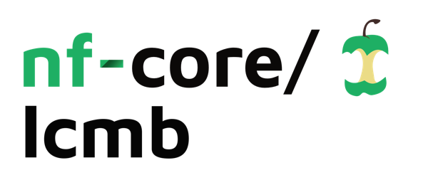

<!-- <h1>
  <picture>
    <source media="(prefers-color-scheme: dark)" srcset="docs/images/nf-core-lcmb_logo_dark.png">
    
  </picture>
</h1> -->

<!-- [](https://github.com/nf-core/lcmb/actions/workflows/ci.yml) -->

[](https://www.nextflow.io/)
<!-- [](https://docs.conda.io/en/latest/) -->
[](https://www.docker.com/)
[](https://sylabs.io/docs/)
[](https://cloud.seqera.io/launch?pipeline=https://github.com/nf-core/lcmb)

<!-- [](https://nfcore.slack.com/channels/lcmb)[](https://twitter.com/nf_core)[](https://mstdn.science/@nf_core)[](https://www.youtube.com/c/nf-core) -->

## Introduction

**lcmb** is a bioinformatics pipeline that processes sequencing data from LCMB pipeline to obtain clean somatic mutations

<!-- TODO nf-core:
   Complete this sentence with a 2-3 sentence summary of what types of data the pipeline ingests, a brief overview of the
   major pipeline sections and the types of output it produces. You're giving an overview to someone new
   to nf-core here, in 15-20 seconds. For an example, see https://github.com/nf-core/rnaseq/blob/master/README.md#introduction
-->

<!-- TODO nf-core: Include a figure that guides the user through the major workflow steps. Many nf-core
     workflows use the "tube map" design for that. See https://nf-co.re/docs/contributing/design_guidelines#examples for examples.   -->
<!-- TODO nf-core: Fill in short bullet-pointed list of the default steps in the pipeline -->

There are two main options, each with five possible subworkflows. These workflows can be turn on and off for different use cases, as follows:

- Option 1: Workflow for samples with matching normal samples (`--with_match_normal true`, default)

1. [CONPAIR_FILTER_WITH_MATCH_NORMAL](subworkflows/local/conpair_match/main.nf), run when `--run_conpair true` (default): Use [conpair](https://github.com/nygenome/Conpair) to filter out contaminated samples.

- pileup: use [`gatk`](https://gatk.broadinstitute.org/hc/en-us/articles/360036896232-Pileup) to calculate pileups for the bam files
- calculate the concordance between samples and their nominated match normal, as well as match normal samples for samples from other donors.
- calculate the contamination score for each sample
- If a sample matches more than ONE match normal (defaul concordance threshold for matching: >= 90%), it is contaminated and filtered out of the input sample sheet.
- If a sample passes a contamination threshold (default >= 0.3%), it is filtered out. If a match normal passes a contamination threshold (default >= 5%), all of its matched samples are filtered out.

2. [LCMB_FILTER_SNV_MATCH](subworkflows/local/lcmb_filter-snv_match/main.nf), run when `--run_filter_snv true` (default). Filtering SNVs, taking vcf files. This workflow can be broken down into the following steps

- Add hairpin label with [`hairpin`](https://github.com/cancerit/hairpin-wrapper)
- Initial filtering. Default initial filtering criteria can be found [here](data/default/snv_default.filter).
- For each donor with multiple samples, use [`cgpVAF`](https://github.com/cancerit/vafCorrect) to calculate and pool VAF across their samples.
- Use beta-binomial test based on VAF to filter out LCM artefact mutations.
- Generate a mutation matrix using [SigProfilerMatrixGenerator](https://github.com/AlexandrovLab/SigProfilerMatrixGenerator)
- Plot the mutation matrix using [SigProfilerPlotting](https://github.com/AlexandrovLab/SigProfilerPlotting/tree/master)

3. [LCMB_FILTER_INDEL_MATCH](subworkflows/local/lcmb_filter-indel_match/main.nf), run when `--run_filter_indel true` (default). Filtering INDELs, taking indel vcf files. This workflow can be broken down into the following steps

- Initial filtering. Default initial filtering criteria can be found in [here](data/default/indel_default.filter).
- For each donor with multiple samples, use [`cgpVAF`](https://github.com/cancerit/vafCorrect) to calculate and pool VAF across their samples.
- Use beta-binomial test based on VAF to filter out LCM artefact mutations.
- Generate a mutation matrix using [SigProfilerMatrixGenerator](https://github.com/AlexandrovLab/SigProfilerMatrixGenerator)
- Plot the mutation matrix using [SigProfilerPlotting](https://github.com/AlexandrovLab/SigProfilerPlotting/tree/master)

4. [PHYLOGENETICS](subworkflows/local/phylogenetics/main.nf) for SNVs, run when `run_phylogenetics true` (default) and `--run_filter_snv true`, or `--run_phylogenetics true --run_filter_snv false --run_filter_indel false` and `--with_topology false`, or `--run_phylogenetics true --run_filter_snv false --run_filter_indel false` and `--snv_then_indel true`. Note that if `run_phylogenetics true` and `--run_filter_snv false --run_filter_indel false`, `--run_conpair` cannot be true, and `with_topology` must be true or `snv_then_indel` cannot be null but `with_topology` and `snv_then_indel` must not both be true. (details in [docs/usage.md](docs/usage.md))

- For each donor pd_id, use NR (reads supporting variant), NV (total depths) and the binary genotype file (outputs from LCMB_FILTER_SNV_MATCH, otherwise should specified in the sample sheet) to create a fasta file of aligned sequences, where each sequence represents a sample of a donor.
- From the fasta file representing each donor, create a phylogenetic tree using [MPBoot](https://bmcecolevol.biomedcentral.com/articles/10.1186/s12862-018-1131-3).
- Assign mutations to each branch of the tree using [treemut](https://github.com/NickWilliamsSanger/treemut)
- For each donor, generate a mutation matrix for the branches using [SigProfilerMatrixGenerator](https://github.com/AlexandrovLab/SigProfilerMatrixGenerator)
- Plot the mutation matrices using [SigProfilerPlotting](https://github.com/AlexandrovLab/SigProfilerPlotting/tree/master)

5. [PHYLOGENETICS_PROVIDED_TREE_TOPOLOGY](subworkflows/local/phylogenetics_provided_topology/main.nf) for Indels, run when `--phylogenetics == true` (default) and `--run_filter_indel true`, or `--run_phylogenetics true --run_filter_snv false --run_filter_indel false` and `--with_topology true`, or `--run_phylogenetics true --run_filter_snv false --run_filter_indel false` and `--snv_then_indel true`. Note that if `run_phylogenetics true` and `--run_filter_snv false --run_filter_indel false`, `--run_conpair` cannot be true, and `with_topology` must be true or `snv_then_indel` cannot be null but `with_topology` and `snv_then_indel` must not both be true. (details in [docs/usage.md](docs/usage.md))

- For each donor pd_id, use NR (reads supporting variant), NV (total depths), the binary genotype file (outputs from FILTER_WITH_MATCH_NORMAL_INDEL) and a tree topology (output from PHYLOGENETICS). If FILTER_WITH_MATCH_NORMAL_INDEL and PHYLOGENETICS are not run, these files should specified in the sample sheet.
- Assign mutations to each branch of the tree (output from PHYLOGENETICS for SNVs or provided in sample sheet)
- For each donor, generate a mutation matrix for the branches using [SigProfilerMatrixGenerator](https://github.com/AlexandrovLab/SigProfilerMatrixGenerator)
- Plot the mutation matrices using [SigProfilerPlotting](https://github.com/AlexandrovLab/SigProfilerPlotting/tree/master)


- Option 2: Workflow for samples without matching normal samples (`-with_match_normal false`)

1. [CONPAIR_FILTER_WITHOUT_MATCH_NORMAL](subworkflows/local/conpair_unmatch/main.nf), run when `--run_conpair true` (default): Use [conpair](https://github.com/nygenome/Conpair) to filter out contaminated samples.

- pileup: use [`gatk`](https://gatk.broadinstitute.org/hc/en-us/articles/360036896232-Pileup) to calculate pileups for the bam files
- calculate the concordance between all samples pairwise.
- Filter out samples if they match samples from more than one donor, or if they match the wrong donor (defaul concordance threshold for matching: >= 90%)
- calculate the contamination score for each sample (match normal is what ever samples they match with that's not themselves)
- If a sample passes a contamination threshold (default >= 0.3%), it is filtered out.

All filtered out samples will be recorded in a log file.

2. [LCMB_FILTER_SNV_UNMATCH](subworkflows/local/lcmb_filter-snv_unmatch/main.nf), run when `--run_filter_snv true` (default). Filtering SNVs, taking vcf files. This workflow can be broken down into the following steps

- Add hairpin label with [`hairpin`](https://github.com/cancerit/hairpin-wrapper)
- Initial filtering. Default initial filtering criteria can be found [here](data/default/snv_default.filter).
- For each donor with multiple samples, use [`cgpVAF`](https://github.com/cancerit/vafCorrect) to calculate and pool VAF across their samples.
- Use exact binomial test to filter out germline mutations
- Use beta-binomial test based on VAF to filter out LCM artefact mutations.
- Generate a mutation matrix using [SigProfilerMatrixGenerator](https://github.com/AlexandrovLab/SigProfilerMatrixGenerator)
- Plot the mutation matrix using [SigProfilerPlotting](https://github.com/AlexandrovLab/SigProfilerPlotting/tree/master)

3. [LCMB_FILTER_INDEL_UNMATCH](subworkflows/local/lcmb_filter-indel_unmatch/main.nf), run when `--run_filter_indel true` (default). Filtering INDELs, taking indel vcf files. This workflow can be broken down into the following steps

- Initial filtering. Default initial filtering criteria can be found in [here](data/default/indel_default.filter).
- For each donor with multiple samples, use [`cgpVAF`](https://github.com/cancerit/vafCorrect) to calculate and pool VAF across their samples.
- Use exact binomial test to filter out germline mutations
- Use beta-binomial test based on VAF to filter out LCM artefact mutations.
- Generate a mutation matrix using [SigProfilerMatrixGenerator](https://github.com/AlexandrovLab/SigProfilerMatrixGenerator)
- Plot the mutation matrix using [SigProfilerPlotting](https://github.com/AlexandrovLab/SigProfilerPlotting/tree/master)

4. [PHYLOGENETICS](subworkflows/local/phylogenetics/main.nf) for SNVs, run when `run_phylogenetics true` (default) and `--run_filter_snv true`, or `--run_phylogenetics true --run_filter_snv false --run_filter_indel false` and `--with_topology false`, or `--run_phylogenetics true --run_filter_snv false --run_filter_indel false` and `--snv_then_indel true`. Note that if `run_phylogenetics true` and `--run_filter_snv false --run_filter_indel false`, `--run_conpair` cannot be true, and `with_topology` must be true or `snv_then_indel` cannot be null but `with_topology` and `snv_then_indel` must not both be true. (details in [docs/usage.md](docs/usage.md))

- For each donor pd_id, use NR (reads supporting variant), NV (total depths) and the binary genotype file (outputs from LCMB_FILTER_SNV_MATCH, otherwise should specified in the sample sheet) to create a fasta file of aligned sequences, where each sequence represents a sample of a donor.
- From the fasta file representing each donor, create a phylogenetic tree using [MPBoot](https://bmcecolevol.biomedcentral.com/articles/10.1186/s12862-018-1131-3).
- Assign mutations to each branch of the tree using [treemut](https://github.com/NickWilliamsSanger/treemut)
- For each donor, generate a mutation matrix for the branches using [SigProfilerMatrixGenerator](https://github.com/AlexandrovLab/SigProfilerMatrixGenerator)
- Plot the mutation matrices using [SigProfilerPlotting](https://github.com/AlexandrovLab/SigProfilerPlotting/tree/master)

5. [PHYLOGENETICS_PROVIDED_TREE_TOPOLOGY](subworkflows/local/phylogenetics_provided_topology/main.nf) for Indels, run when `--phylogenetics == true` (default) and `--run_filter_indel true`, or `--run_phylogenetics true --run_filter_snv false --run_filter_indel false` and `--with_topology true`, or `--run_phylogenetics true --run_filter_snv false --run_filter_indel false` and `--snv_then_indel true`. Note that if `run_phylogenetics true` and `--run_filter_snv false --run_filter_indel false`, `--run_conpair` cannot be true, and `with_topology` must be true or `snv_then_indel` cannot be null but `with_topology` and `snv_then_indel` must not both be true. (details in [docs/usage.md](docs/usage.md))

- For each donor pd_id, use NR (reads supporting variant), NV (total depths), the binary genotype file (outputs from FILTER_WITH_MATCH_NORMAL_INDEL) and a tree topology (output from PHYLOGENETICS). If FILTER_WITH_MATCH_NORMAL_INDEL and PHYLOGENETICS are not run, these files should specified in the sample sheet.
- Assign mutations to each branch of the tree (output from PHYLOGENETICS for SNVs or provided in sample sheet)
- For each donor, generate a mutation matrix for the branches using [SigProfilerMatrixGenerator](https://github.com/AlexandrovLab/SigProfilerMatrixGenerator)
- Plot the mutation matrices using [SigProfilerPlotting](https://github.com/AlexandrovLab/SigProfilerPlotting/tree/master)


## Dependencies

- Nextflow >= 24.04.2 required

> [!NOTE]
> If you are new to Nextflow and nf-core, please refer to [this page](https://nf-co.re/docs/usage/installation) on how to set-up Nextflow.

The following does not need to be installed if using a container runtime like Docker or Singularity

- python, required packages: `pandas` (1.5.3 recommended), `numpy` (1.26.1 recommended), `scipy`, `matplotlib` (3.8.2 recommended), `pillow` (10.1.0 recommended), `SigProfilerMatrixGenerator`, `SigProfilerPlotting`
- [`gatk`](https://gatk.broadinstitute.org/hc/en-us/articles/360036896232-Pileup)
- [`hairpin`](https://github.com/cancerit/hairpin-wrapper)
- [`vafCorrect`](https://github.com/cancerit/vafCorrect)
- R, required packages: `ape`, `ggplot2`, `ggtree`, `treemut`
- [MPBoot](https://bmcecolevol.biomedcentral.com/articles/10.1186/s12862-018-1131-3)

## Installation

Clone this repository, including the MutationsPy submodule

```
git clone git@github.com:Phuong-Le/lcmb.git
```

## Usage

> [NOT PUBLIC YET] Make sure to [test your setup](https://nf-co.re/docs/usage/introduction#how-to-run-a-pipeline) with `-profile test` before running the workflow on actual data.

The input sample sheet should be in a tab delimited format (extension must be .tsv), like [samplesheet_full_pipeline.tsv](assets/samplesheet_full_pipeline.tsv). The column requirements depends on which subworkflows you would like to run (column names must be accurate but no need to be in this order, redundant columns will be ignored):


| Column    | Description                                                                                                                                                                            |
| --------- | -------------------------------------------------------------------------------------------------------------------------------------------------------------------------------------- |
| REQUIRED COLUMNS FOR ALL SUBWORKFLOWS  |
| `pdid` |  Donor ID for your sample |                                                            |
| REQUIRED COLUMNS FOR CONPAIR, FILTER_SNV and/or FILTER_INDEL (`--run_conpair true` and/or `--run_filter_snv true` and/or `--run_filter_indel true`) |
| `sample_id`  | sample ID, must be unique |
| `match_normal_id` |  ID for your match normal sample |                                                            |
| `bam` | bam file for `sample_id`, must exist |                                                       |
| `bai` | tabix index file for `bam`, must exist |
| `bam_match` | bam file for `match_normal_id`, must exist |
| `bai_match` | tabix index file for `bam_match`, must exist |
| REQUIRED COLUMNS FOR FILTER_SNV and/or FILTER_INDEL PIPELINE (`--run_filter_snv true` and/or `--run_filter_indel true`)  |
| `bas` | bam status file for `bam`, must exist |
| `met` | met (samtools markedup) file for `bam`, must exist |
| REQUIRED COLUMNS FOR FILTER_SNV (`--run_filter_snv true`)  |
| `snv_vcf` | VCF file for the SNVs of `sample_id`, must exist |
| `snv_vcf_tbi` | tabix index file for VCF file for `snv_vcf_tbi`, must exist |
| REQUIRED COLUMNS FOR FILTER_INDEL (`--run_filter_indel true`)  |
| `indel_vcf` | VCF file for the indels of `sample_id`, must exist |
| `indel_vcf_tbi` | tabix index file for VCF file for `indel_vcf_tbi`, must exist |
| REQUIRED COLUMNS FOR PHYLOGENETICS FOR BOTH SNVs AND INDELs WITHOUT FILTERING SNVs OR INDELs (`--run_phylogenetics true --run_filter_snv false --run_filter_indel false --snv_then_indel true`)  |
| `nr_path_snv` | NR file (reads supporting variants) for SNVs for `pdid`, must exist |
| `nv_path_snv` | NV file (depths at the variant locus) for SNVs for `pdid`, must exist |
| `genotype_bin_path_snv` | binary genotype file for SNVs for `pdid`, must exist |
| `nr_path_indel` | NR file (reads supporting variants) for INDELs for `pdid`, must exist |
| `nv_path_indel` | NV file (depths at the variant locus) for INDELs for `pdid`, must exist |
| `genotype_bin_path_indel` | binary genotype file for INDELs for `pdid`, must exist |
| REQUIRED COLUMNS FOR PHYLOGENETICS or PHYLOGENETICS-GIVEN-TREE-TOPOLOGY WITHOUT RUNNNING FILTERING SNVs OR INDELs (`--run_phylogenetics true --run_filter_snv false --run_filter_indel false --snv_then_indel [false/null]`)  |
| `nr_path` | NR file (reads supporting variants) for `pdid`, must exist |
| `nv_path` | NV file (depths at the variant locus) for `pdid`, must exist |
| `genotype_bin_path` | binary genotype file for `pdid`, must exist |
| REQUIRED COLUMNS FOR PHYLOGENETICS-GIVEN-TREE-TOPOLOGY WITHOUT RUNNNING FILTERING SNVs (`--run_phylogenetics true --run_filter_snv false --run_filter_indel true`, or `--run_phylogenetics true --run_filter_snv false --run_filter_indel false --with_topology true`)  |
| `topology` | tree topology file for `pdid`, must exist |


Please find the detailed instructions to run the pipeline, including the input parameters in [docs/usage.md](docs/usage.md). You can run the pipeline using:

```bash

nextflow run /path/to/lcmb/main.nf \
  -profile <docker/singularity/.../institute> \
   --input /path/to/samplesheet.tsv \
   --with_match_normal true \
   --run_conpair true \
   --run_filter_snv true \
   --run_filter_indel true \
   --run_phylogenetics true \
   --hairpin_genome hg38 \
   --sigprofiler_genome GRCh38 \
   --use_custom_genome true \
   --genome genome_label_in_custom_genome_config \ #eg your_genome_label
   --outdir /path/to/outdir
```


The following required parameters (depending which subworkflows are run) can be specified either directly via the `nextflow run` command, or via a custom genome profile like in the above example (this involves setting `use_custom_genome` to true and specifying the `genome` label - detailed instructions to create a custom genome profile can be found in [docs/usage.md](docs/usage.md))

```
--fasta
--fai
--fasta_dict
--marker_bed
--marker_txt
--hidepth
--hidepth_tbi
```

> [!WARNING]
> Please provide pipeline parameters via the CLI or Nextflow `-params-file` option. Custom config files including those provided by the `-c` Nextflow option can be used to provide any configuration _**except for parameters**_; see [docs](https://nf-co.re/docs/usage/getting_started/configuration#custom-configuration-files).

## Sanger users

Sanger users can run the pipeline as follows. Please refer to [docs/sanger.md](docs/sanger.md) to ensure you have the right set up.

```bash
module load cellgen/nextflow/24.10.2
module load ISG/singularity/3.11.4

outdir=/path/to/outdir
mkdir -p $outdir
script=/path/to/lcmb/main.nf # should be part of this pipeline
config_file=/path/to/lcmb/sanger_lsf.config # should be part of this pipeline
samplesheet=/path/to/samplesheet.tsv # or .csv, format should be consistent with extension

species=Human # please refer to docs/usage.md
species_assembly=GRCh38 # please refer to docs/usage.md
custom_genome_base=/lustre/scratch124/casm/team78pipelines/canpipe/live/ref/Homo_sapiens # please let me know if you're using a different genome so I can update the config for you
genome=GRCh38_full_analysis_set_plus_decoy_hla # same as above
hairpin_genome=hg38
sigprofiler_genome=GRCh38

with_match_normal=false
run_conpair=false
run_filter_snv=true
run_filter_indel=true
run_phylogenetics=false

bsub -cwd ${working_dir} -q week -o %J.out -e %J.err -R "select[mem>5000] rusage[mem=5000]" -M5000 -env "all" \
    "nextflow run $script -c ${config_file} --input $input --outdir $outdir --run_conpair ${run_conpair} --run_filter_snv ${run_filter_snv} --run_filter_indel ${run_filter_indel} --run_phylogenetics ${run_phylogenetics}  --use_custom_genome true --custom_genome_base $custom_genome_base --genome ${genome} --hairpin_genome ${hairpin_genome} --sigprofiler_genome ${sigprofiler_genome} --with_match_normal ${with_match_normal} -profile singularity -resume"
```

## Pipeline output

<!-- To see the results of an example test run with a full size dataset refer to the [results](https://nf-co.re/sangersomatic/results) tab on the nf-core website pipeline page. -->
For more details about the output files and reports, please refer to the
[output documentation](docs/output.md).

## Credits

Sangersomatic was originally written by Phuong Le, Rashesh Sanghvi, Alex Tidd, Alex Byrne and Raul Alacantra Aragon.

We thank the following people for their extensive assistance in the development of this pipeline:

Chloe Pacyna
Yichen Wang
Shriram Bhosle
Daniel Leongamornlert


<!-- TODO nf-core: If applicable, make list of people who have also contributed -->

## Contributions and Support

Please feel free to contribute by either creating a pull request or create a new issue on this github repo

## Citations

<!-- TODO nf-core: Add citation for pipeline after first release. Uncomment lines below and update Zenodo doi and badge at the top of this file. -->
<!-- If you use nf-core/sangersomatic for your analysis, please cite it using the following doi: [10.5281/zenodo.XXXXXX](https://doi.org/10.5281/zenodo.XXXXXX) -->

<!-- TODO nf-core: Add bibliography of tools and data used in your pipeline -->

An extensive list of references for the tools used by the pipeline can be found in the [`CITATIONS.md`](CITATIONS.md) file.

